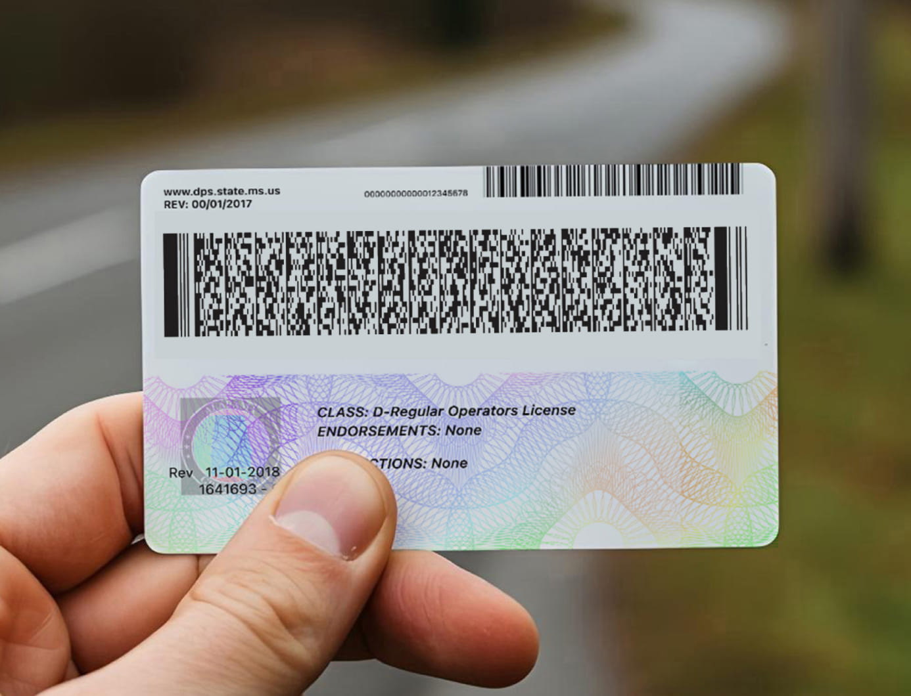

MRZ [MRZ Online Cam Reader](https://ravendano014.github.io/mrz/)

[MRZ Online Image Reader](https://ravendano014.github.io/mrz/MRZFeed.html)

[MRZ Coder](https://ravendano014.github.io/mrz/MRZGen.html)

[MRZ Decoder](https://ravendano014.github.io/mrz/MRZReaderPaerser.html)

[MRZ Persitent](https://ravendano014.github.io/mrz/mrz.html)

PDF417  [PDF417 & Image Scanner](https://ravendano014.github.io/mrz/PDF417Scanner.html)

[PDF417 ROI](https://ravendano014.github.io/mrz/PDF417ROI.html)

[PDF417 Roboflow](https://ravendano014.github.io/mrz/PDF417Roboflow.html)

[PDF417 Decoder](https://ravendano014.github.io/mrz/PDF417Decoder.html)

[PDF417 Reader](https://ravendano014.github.io/mrz/PDF417Reader.html)

[PDF417 Coder](https://ravendano014.github.io/mrz/PDF417Coder.html)

[PDF417 QR Scanner](https://ravendano014.github.io/mrz/PDF417QR.html)

[PDF417 Multi Scanner](https://ravendano014.github.io/mrz/PDF417Multi.html)

[PDF417 ML](https://ravendano014.github.io/mrz/PDF417ML.html)

[PDF417 PWA Scanner](https://ravendano014.github.io/mrz/PDF417PWA.html)

Barcode</spn> [Barcode Scanner](https://ravendano014.github.io/mrz/Barcode.html)

Micro PDF417  [Micro PDF417 & Image Scanner](https://ravendano014.github.io/mrz/MicroPDF417Scanner.html)

